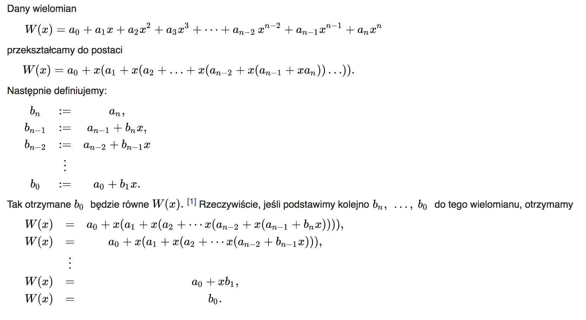
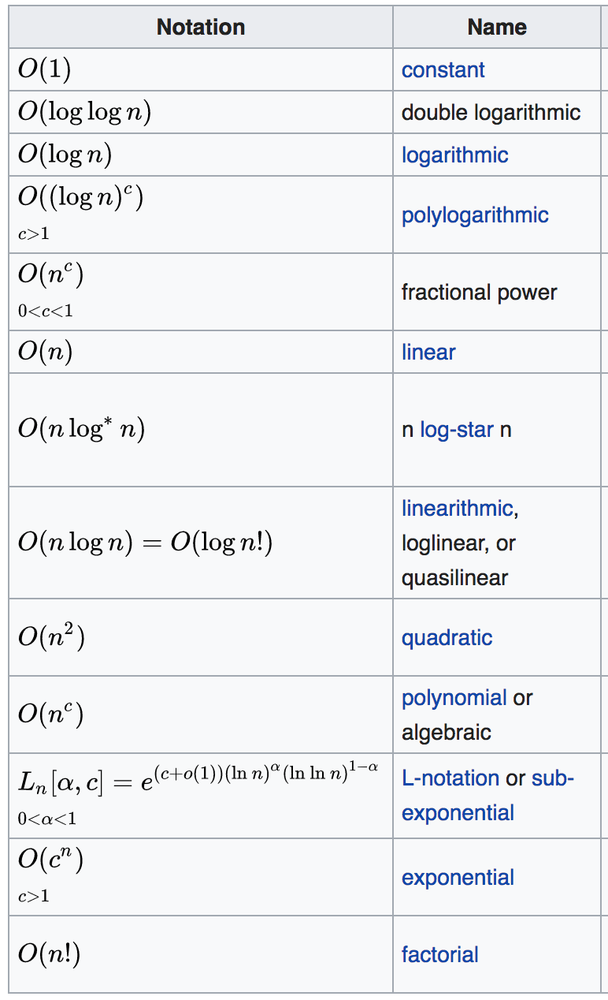

# Algorytmy

1. [Pojęcie algorytmu.](#pojęcie-algorytmu)
2. [Klasyczne algorytmy](#klasyczne-algorytmy)
3. [Czasowa i pamięciowa złożoność obliczeniowa algorytmu. Złożoność optymistyczna, pesymistyczna, średnia.](#złożoność-obliczeniowa)
4. [Notacja asymptotyczna i jej znaczenie w teorii algorytmów, rzędy wielkości funkcji.](#notacja-asymptotyczna)
5. [Algorytmy sortowania. Dokładny opis wraz z pseudokodem, sortowania bąbelkowego, przez wstawianie oraz sortowania przez wybieranie. Zasada działania sortowania przez scalanie oraz sortowania szybkiego. Właściwości wszystkich powyższych algorytmów oraz ich złożoności czasowe.](#algorytmy-sortowania)
6. [Algorytmy rekurencyjne; zapisywanie wybranych klasycznych algorytmów w postaci rekurencyjnej.](#algorytmy-rekurencyjne) 
7. [Metoda dziel i zwyciężaj. Metoda równego podziału, metoda Newtona-Raphsona (stycznych).](#metoda-dziel-i-zwyciężaj) 
8. [Abstrakcyjne struktury danych: stosy, kolejki FIFO, kolejki priorytetowe, słowniki - ich implementacje (np tablice, listy dowiązane, kopce, drzewa binarne, drzewa BST) oraz zastosowania.](#struktury-danych)
8. [Kodowanie Huffmana.](#kodowanie-huffmana)
10. [Algorytm Kruskala.](#algorytm-kruskala)
11. [Tablice z haszowaniem (asocjacyjne). Rozwiązywanie kolizji - metoda łańcuchowa i adresowanie otwarte.](#tablice-z-haszowaniem)
12. [Szyfrowanie Cezara.](#szyfrowanie-cezara)

## Pojęcie algorytmu

Algorytm jest ciągiem kroków obliczeniowych przekształcających dane wejściowe w wyjściowe (wynik działania algorytmu).

Algorytm można również traktować jako środek umożliwiający rozwiązanie konkretnego problemu obliczeniowego.

## Klasyczne algorytmy

### Test pierwszości

- Algorytm naiwny
  - Dana jest liczba n,
  - Dzielimy liczbę n przez liczby od 2 do sqrt(n)
  - Jeżeli liczba n jest podzielna przez dowolną z powyższych liczb jest ona liczbą złożoną
  - Jeżeli liczba n nie jest podzielna przez żadną z powyższych liczb, jest ona liczbą pierwszą
- Sito Eratostenesa może być wykorzystane w powyższym algorytmie
- Chiński test pierwszości (hueh)

### Algorytm Euklidesa

#### Wersja z odejmowaniem

```
Wejście:
a, b – liczby naturalne, których NWD poszukujemy, a, b   N

Wyjście:
NWD liczb a i b

Lista kroków:
K01:	Dopóki a ≠ b wykonuj krok K02	 
K02:	    Jeśli a < b, to b ← b - a
    inaczej          a ← a - b	; od większej liczby odejmujemy mniejszą aż się zrównają
K03:	Pisz a	; wtedy dowolna z nich jest NWD
K04:	Zakończ
```

#### Wersja z dzieleniem

```
Wejście
a, b – liczby naturalne, których NWD poszukujemy, a, b   N

Wyjście:
NWD liczb a i b

Zmienne pomocnicze
t – tymczasowo przechowuje dzielnik,  t   N

Lista kroków:
K01:	Dopóki b ≠ 0 wykonuj kroki K02...K04	 
K02:	    t ← b	; zapamiętujemy dzielnik
K03:	    b ← a mod b	; wyznaczamy resztę z dzielenia, która staje się dzielnikiem
K04:	    a ← t	; poprzedni dzielnik staje teraz się dzielną
K05:	Pisz a	; NWD jest ostatnią dzielną
K06:	Zakończ
```

### Wyszukiwanie binarne

```
Wejście
ip	 – 	indeks pierwszego elementu w tablicy Z, ip   C
ik	 –	indeks ostatniego elementu w tablicy Z, ik   C
Z	 –	tablica do wyszukania elementu. Indeksy od ip do ik
k	 –	wartość poszukiwanego elementu – tzw. klucz
Wyjście:
p = indeks elementu o kluczu k lub
p = -1, jeśli nie odnalezienia elementu o takim kluczu.

Zmienne pomocnicze
isr	 – 	indeks elementu środkowego. isr   C
Lista kroków:
K01:	p ← -1	; zakładamy, iż k nie występuje w zbiorze
K02:	Dopóki ip ≤ ik wykonuj K02...K10	; w pętli poszukujemy elementu o wartości k
K03:	
    isr =	 	ip + ik	 
2
; wyznaczamy element środkowy
K04:	    Jeśli k ≠ Z[isr], to idź do K07	 
K05:	    p ← isr	; element znaleziony, kończymy
K06:	    Idź do K11	 
K07:	    Jeśli k < Z[isr], to idź do K10	; wybieramy odpowiednią połówkę zbioru na dalsze poszukiwania
K08:	    ip ← isr + 1	; k > Z[isr] → druga połówka
K09:	    Następny obieg pętli K02	 
K10:	    ik ← isr - 1	; k < Z[isr] → pierwsza połówka
K11:	Zakończ z wynikiem p	 
```

### Znajdowanie najmniejszego lub największego elementu w zbiorze

```
Wejście
n	 –   	liczba elementów w tablicy Z, n   N
Z	 –	tablica zawierająca elementy do zliczania. Indeksy elementów rozpoczynają się od 0, a kończą na n - 1.
Wyjście:
Wartość największego elementu zbioru.

Zmienne pomocnicze
i	 – 	przebiega przez kolejne indeksy elementów Z. i    C
maxZ	 –	tymczasowy element maksymalny
Lista kroków:
K01:	maxZ ← Z[0]	; za tymczasowy element maksymalny bierzemy pierwszy element
K02:	Dla i = 1,2,...,n-1 wykonuj K03	; przeglądamy następne elementy zbioru
K03:	    Jeśli Z[i] > maxZ, to maxZ ← Z[i]	; jeśli natrafimy na większy od maxZ, to zapamiętujemy go w maxZ
K04:	Zakończ z wynikiem maxZ	 
```

### Znajdowanie jednocześnie najmniejszego i największego elementu w zbiorze

```
Wejście
n	 –   	liczba elementów w tablicy Z, n   N
Z	 –	tablica zawierająca elementy do zliczania. Indeksy elementów rozpoczynają się od 0, a kończą na n - 1. Tablica musi umożliwiać dodanie elementu, jeśli n jest nieparzyste.
Wyjście:
Element minimalny i maksymalny w tablicy Z

Zmienne pomocnicze
i	 – 	przebiega przez kolejne indeksy elementów Z. i   C
maxZ	 –	tymczasowy element maksymalny
maxp	 –	pozycja tymczasowego elementu maksymalnego
Lista kroków:
K01:	Jeśli n mod 2 = 1, Z[n] ← Z[n-1]	; jeśli nieparzysta liczba elementów, dublujemy ostatni
K02:	minZ ← największa liczba całkowita	; inicjujemy minZ i maxZ
K03:	maxZ ← najmniejsza liczba całkowita	 
K04:	i ← 0	 
K05:	Dopóki i < n wykonuj K06...K12	; wybieramy pary kolejnych elementów
K06:	    Jeśli Z[i] > Z[i+1], to idź do K10	; rozdzielamy je na element mniejszy i większy
K07:	    Jeśli Z[i] < minZ, to minZ ← Z[i]	; Z[i] - mniejszy, Z[i+1] - większy
K08:	    Jeśli Z[i+1] > maxZ, to maxZ ← Z[i+1]	 
K09:	    Idź do K12	 
K10:	    Jeśli Z[i] > maxZ, to maxZ ← Z[i]	; Z[i] - większy, Z[i+1] - mniejszy
K11:	    Jeśli Z[i+1] < minZ, to minZ ← Z[i+1]	 
K12:	    i ← i + 2	; przechodzimy do następnej pary elementów
K13:	Pisz minZ, maxZ	; wyprowadzamy wyniki
K14:	Zakończ	 
```

### Schemat Hornera



### Szybkie potęgowanie

```
funkcja potęga(x, n)
    jeżeli n = 0
        zwróć 1
    jeżeli n jest nieparzysta
        zwróć x · potęga(x, n - 1)
    w przeciwnym przypadku
        a = potęga(x, n/2)
    zwróć a2
```

### Wyszukiwanie wierzchołka 1D i 2D

???

## Złożoność obliczeniowa

### Czasowa

Przyjętą miarą złożoności czasowej jest liczba operacji podstawowych w zależności od rozmiaru wejścia. Pomiar rzeczywistego czasu zegarowego jest mało użyteczny ze względu na silną zależność od sposobu realizacji algorytmu, użytego kompilatora oraz maszyny, na której algorytm wykonujemy. Dlatego w charakterze czasu wykonania rozpatruje się zwykle liczbę operacji podstawowych (dominujących). Operacjami podstawowymi mogą być na przykład: podstawienie, porównanie lub prosta operacja arytmetyczna.

### Pamięciowa

Podobnie jak złożoność czasowa jest miarą czasu działania algorytmu, tak złożoność pamięciowa jest miarą ilości wykorzystanej pamięci. Jako tę ilość najczęściej przyjmuje się użytą pamięć maszyny abstrakcyjnej (na przykład liczbę komórek pamięci maszyny RAM) w funkcji rozmiaru wejścia. Możliwe jest również obliczanie rozmiaru potrzebnej pamięci fizycznej wyrażonej w bitach lub bajtach.

## Notacja Asymptotyczna

Asymptotyczne tempo wzrostu jest miarą określającą zachowanie wartości funkcji wraz ze wzrostem jej argumentów.
Asymptotyczne tempo wzrostu opisuje jak szybko dana funkcja rośnie lub maleje, abstrahując od konkretnej postaci tych zmian.

### Notacja 'Duże Theta'

Ogranicza funkcję od góry oraz od dołu.

### Notacja 'Duże O'

Ogranicza funkcję od góry.

Dodatkowo, definiuje się niedokładne ograniczenie - 'małe o', np:

2n = o(n^2)

### Notacja 'Duże Omega'

Ogranicza funkcję od dołu.

Dodatkowo, definiuje się niedokładne ograniczenie - 'małe omega'.

### Rzędy wielkości funkcji



## Algorytmy Sortowania

### Bąbelkowe

```
Dane wejściowe
n	- liczba elementów w sortowanym zbiorze, n   N
d[ ]	- zbiór n-elementowy, który będzie sortowany. Elementy zbioru mają indeksy od 1 do n.
Dane wyjściowe
d[ ]	- posortowany zbiór n-elementowy. Elementy zbioru mają indeksy od 1 do n.
Zmienne pomocnicze
i, j	- zmienne sterujące pętli, i, j Î N
 

Lista kroków
K01:	Dla j = 1,2,...,n - 1: wykonuj K02
K02:	    Dla i = 1,2,...,n - 1: jeśli d[i] > d[i + 1], to d[i] ↔ d[i + 1]
K03:	Zakończ
```

Przykład:


Cechy Algorytmu Sortowania Bąbelkowego

- klasa złożoności obliczeniowej optymistyczna  O(n2)
- klasa złożoności obliczeniowej typowa  O(n2)
- klasa złożoności obliczeniowej pesymistyczna O(n2)
- Sortowanie w miejscu TAK
- Stabilność TAK

### Wstawianie

```
Dane wejściowe
n	- liczba elementów w sortowanym zbiorze, n   N
d[ ]	- zbiór n-elementowy, który będzie sortowany. Elementy zbioru mają indeksy od 1 do n.
Dane wyjściowe
d[ ]	- posortowany zbiór n-elementowy. Elementy zbioru mają indeksy od 1 do n.
Zmienne pomocnicze
i, j	- zmienne sterujące pętli, i, j   N
x	- zawiera wybrany ze zbioru element.
 

Lista kroków
K01:	Dla j = n - 1, n - 2, ..., 1: wykonuj K02...K04
K02:	    x ← d[j];  i ← j + 1
K03:	    Dopóki ( i ≤ n )  ∧  ( x > d[i] ): wykonuj d[i - 1] ← d[i];  i ← i + 1
K04:	    d[i - 1] ← x
K05:	Zakończ
```

Przykład:


Cechy Algorytmu Sortowania Przez Wstawianie

- klasa złożoności obliczeniowej optymistyczna	O(n)
- klasa złożoności obliczeniowej typowa	O(n2)
- klasa złożoności obliczeniowej pesymistyczna	O(n2)
- Sortowanie w miejscu	TAK
- Stabilność	TAK

### Wybieranie

```
Dane wejściowe
n	- liczba elementów w sortowanym zbiorze, n   N
d[ ]	- zbiór n-elementowy, który będzie sortowany. Elementy zbioru mają indeksy od 1 do n.
Dane wyjściowe
d[ ]	- posortowany zbiór n-elementowy. Elementy zbioru mają indeksy od 1 do n.
Zmienne pomocnicze
i, j	- zmienne sterujące pętli, i, j  N
pmin	- pozycja elementu minimalnego w zbiorze d[ ],  pmin   N
 

Lista kroków
K01:	Dla j = 1, 2, ..., n - 1: wykonuj K02...K04
K02:	    pmin ← j
K03:	    Dla i = j + 1,  j + 2, ..., n: jeśli d[i] < d[pmin], to pmin ← i
K04:	    d[j] ↔ d[pmin]
K05:	Zakończ
```

Przykład:


Cechy Algorytmu Sortowania Przez Wybór

- klasa złożoności obliczeniowej optymistyczna	O(n2)
- klasa złożoności obliczeniowej typowa	O(n2)
- klasa złożoności obliczeniowej pesymistyczna	O(n2)
- Sortowanie w miejscu	TAK
- Stabilność	NIE

### Scalanie

Wyróżnić można trzy podstawowe kroki:

- Podziel zestaw danych na dwie równe części
- Zastosuj sortowanie przez scalanie dla każdej z nich oddzielnie, chyba że pozostał już tylko jeden element;
- Połącz posortowane podciągi w jeden ciąg posortowany.

Przykład:


Cechy Algorytmu Sortowania Przez Scalanie

- klasa złożoności obliczeniowej optymistyczna	O(n log n)
- klasa złożoności obliczeniowej typowa O(n log n)
- klasa złożoności obliczeniowej pesymistyczna O(n log n)
- Sortowanie w miejscu	NIE
- Stabilność	TAK

### QuickSort

Z tablicy wybiera się element rozdzielający, po czym tablica jest dzielona na dwa fragmenty: do początkowego przenoszone są wszystkie elementy nie większe od rozdzielającego, do końcowego wszystkie większe. Potem sortuje się osobno początkową i końcową część tablicy[1]. Rekursja kończy się, gdy kolejny fragment uzyskany z podziału zawiera pojedynczy element, jako że jednoelementowa tablica nie wymaga sortowania.

Przykład:


Cechy Algorytmu Sortowania Szybkiego

- klasa złożoności obliczeniowej optymistyczna	O(n log n)
- klasa złożoności obliczeniowej typowa O(n log n)
- klasa złożoności obliczeniowej pesymistyczna	O(n2)
- Sortowanie w miejscu	TAK
- Stabilność	NIE

## Algorytmy Rekurencyjne

Charakterystyczną cechą funkcji (procedury) rekurencyjnej jest to, że wywołuje ona samą siebie. Drugą cechą rekursji jest jej dziedzina, którą mogą być tylko liczby naturalne.

## Metoda Dziel I Zwyciężaj

### Dziel I Zwyciężaj

Dziel i zwyciężaj (ang. divide and conquer) – jedna z głównych metod projektowania algorytmów w informatyce, prowadząca do bardzo efektywnych rozwiązań. Nazwa pochodzi od łacińskiej sentencji dziel i rządź (łac. divide et impera). W strategii tej problem dzieli się rekurencyjnie na dwa lub więcej mniejszych podproblemów tego samego (lub podobnego) typu tak długo, aż fragmenty staną się wystarczająco proste do bezpośredniego rozwiązania. Z kolei rozwiązania otrzymane dla podproblemów scala się, uzyskując rozwiązanie całego zadania.

### Metoda Równego Podziału

[Link](http://www.algorytm.org/procedury-numeryczne/metoda-polowienia.html)

### Metoda Newtona-Raphsona

[Link](http://www.algorytm.org/procedury-numeryczne/metoda-newtona.html)

## Struktury Danych

### Stosy

Stos to struktura danych, którą możemy porównać do naleśników nakładanych na jedną stertę. W danej chwili możemy wykonać jedną z dwóch operacji:

- push(element) - dodanie elementu na wierzchołek stosu (tu naleśnika)
- pop() - zdjęcie elementu z wierzchołka stosu

W tej strukturze danych nie mamy bezpośredniego dostępu do elementu, który nie jest na szczycie. Aby dostać się do innego elementu niż wierzchołek, należy zdjąć wszystkie, które są nad nim.

Stos nazywany jest także kolejką lifo - last in first out - ostatni wrzucony na stos jest pierwszym do zdjęcia. Używany jest w wielu algorytmach, między innymi w algorytmie grafowym - przeszukiwanie w głąb - DFS.

Implementacja bazuje na tablicach i listach dowiązanych:
[Link](http://www.algorytm.edu.pl/struktury-danych/kolejka-fifo.html)

### Kolejki FIFO

Kolejka (ang. queue) jest sekwencyjną strukturą danych o takiej własności, iż element zapisany jako pierwszy jest również odczytywany jako pierwszy. Taka struktura w literaturze informatycznej nosi nazwę FIFO (ang. First In First Out – pierwszy wchodzi, pierwszy wychodzi). Kolejkę możemy sobie wyobrazić jako tubę – elementy wstawiamy do tuby z jednej strony, po czym przesuwają się one wewnątrz i wychodzą z drugiej strony w tej samej kolejności, w jakiej zostały do tuby włożone.

Dla kolejki są zdefiniowane operacje:

- Sprawdzenie, czy kolejka jest pusta – operacja empty zwraca true, jeśli kolejka nie zawiera żadnego elementu, w przeciwnym razie zwraca false.
- Odczyt elementu z początku kolejki – operacja front zwraca wskazanie do elementu, który jest pierwszy w kolejce.
- Zapis elementu na koniec kolejki – operacja push dopisuje nowy element na koniec elementów przechowywanych w kolejce.
- Usunięcie elementu z kolejki – operacja pop usuwa z kolejki pierwszy element.

Implementacja bazuje na tablicach i listach dowiązanych:
[Link](http://eduinf.waw.pl/inf/alg/001_search/0105.php)

### Kolejki Priorytetowe

Oferują następujące operacje:

- MakePQ(): tworzy nową, pustą kolejkę;
- Insert(H,x): wstawia element x (o kluczu z pewnego liniowo uporządkowanego uniwersum) do kolejki H;
- FindMin(H): zwraca element o najmniejszym kluczu w kolejce H;
- DelMin(H): zwraca element o najmniejszym kluczu w kolejce H, usuwając go przy tym z H.

Zastosowania:

- algorytm Dijkstry wyznaczania najkrótszych ścieżek w grafach;
- algorytm Prima znajdowania minimalnego drzewa rozpinającego;
- symulacja sterowana zdarzeniami;
- metoda zamiatania w geometrii obliczeniowej;
- kodowanie Huffmana;
- sortowanie (algorytm Heapsort).

Implementacja bazuje na drzewach i kopcach:
[Link](http://wazniak.mimuw.edu.pl/index.php?title=Algorytmy_i_struktury_danych/Kolejki_priorytetowe)

### Słowniki

Słownik to struktura danych reprezentująca dynamiczny (tzn. mogący zmieniac się w czasie) zbiór elementów (kluczy), na którym można wykonywać następujące operacje:

- Find(S,x): zwraca klucz x ze słownika S, albo NULL jeśli tego klucza nie ma w słowniku;
- Insert(S,x): wstawia klucz x do słownika S;
- Delete(S,x): usuwa klucz x ze słownika S.

Implementacja bazuje głównie na drzewach (AVL, BST, B-Drzewa):
[Link](http://wazniak.mimuw.edu.pl/index.php?title=Algorytmy_i_struktury_danych/S%C5%82owniki)

## Kodowanie Huffmana

[Wiki](https://pl.wikipedia.org/wiki/Kodowanie_Huffmana)

## Algorytm Kruskala

[Wiki](https://pl.wikipedia.org/wiki/Algorytm_Kruskala)

## Tablice z Haszowaniem

[Link](http://eduinf.waw.pl/inf/alg/001_search/0067e.php)

## Szyfrowanie Cezara

KEK
