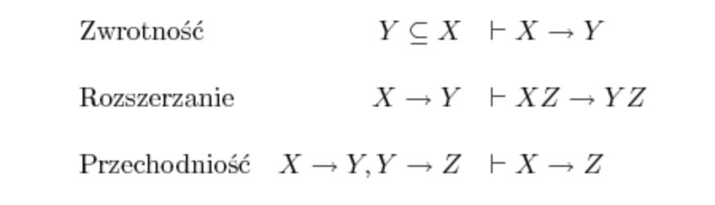

# Bazy Danych

1. [Relacyjny model danych](#relacyjny-model-danych) i algebra relacji: atrybuty, dziedziny atrybutów, krotki i relacje; operacje na relacjach
2. [Język SQL](#język-sql) – zapytania, selekcja, sortowanie, grupowanie, funkcje agregujące, podzapytania.
3. [Instrukcje DML](#instrukcje-dml) – usuwanie, aktualizacja i dołączanie danych.
4. [Instrukcje DDL](#instrukcje-ddl) – tworzenie tabel, modyfikacje struktury tabel, usuwanie tabel.
5. [Zależności funkcyjne.](#zależności-funkcyjne) Aksjomaty Armstronga. Integralność danych (klucze, klucze obce). Opcje propagacji.
6. [Postacie normalne:](#normalizacja) 1NF, 2NF, 3NF, BCNF, 4NF. Normalizacja.
7. [Indeksy.](#indeksy) Widoki. Procedury składowane. Wyzwalacze.
8. [Modelowanie danych:](#modelowanie-danych) model logiczny (diagram związków encji - ERD) i model relacyjny 
9. [Systemy transakcyjne i analityczne](#systemy) - podstawowe różnice
10. [Transakcje.](#transakcje) Własności ACID. Poziomy izolacji.
11. [Administrowanie](#administrowanie) użytkownikami bazy danych i ochrona danych.

## Relacyjny model danych

Model organizacji danych bazujący na matematycznej teorii mnogości, w szczególności na pojęciu relacji.

W najprostszym ujęciu w modelu relacyjnym dane grupowane są w relacje, które reprezentowane są przez tablice. Relacje są pewnym zbiorem rekordów o identycznej strukturze wewnętrznie powiązanych za pomocą związków zachodzących pomiędzy danymi. Relacje zgrupowane są w tzw. schematy bazy danych. Relacją może być tabela zawierająca dane teleadresowe pracowników, zaś schemat może zawierać wszystkie dane dotyczące firmy.

### Relacje i reszta pojęć

Relacja - dowolny podzbiór iloczynu kartezjańskiego skończonej liczby zbiorów.

Krotka - struktura danych będąca odzwierciedleniem matematycznej n-ki, tj. uporządkowanego ciągu wartości

Zatem relacja r typu R to nic innego jak skończony zbiór krotek k typu R.

Atrybut - 'pole' encji (np. nazwa, data, wysokość itd...), kolumna krotki

### Algebra relacji

- Selekcja (wybór) 
  - (sigma){{warunek}}(R). 
  - Zgodnie z nazwą wybiera ona z relacji tylko te krotki, dla których jest spełniony podany warunek.
- Rzutowanie (projekcja)
  - (pi){{kolumna_{1},...,kolumna_{n}}}(R)
  - Z relacji wybieramy tylko podane kolumny.
- Złączenie
  - R{\theta}{\Join}S 
  - Podobne do iloczynu kartezjańskiego, ale łączy się ze sobą tylko pary wierszy spełniające podany warunek (theta).
  
## Język SQL

- SQL (Structured Query Language) – język zapytań dla relacyjnych baz danych;
- Język nieproceduralny – użytkownik wyszczególnia operacje co ma być zrobione, a nie w jaki sposób.
- SQL posiada optymalizator, który wybiera optymalną ścieżkę wykonywania zapytania.
- SQL ma kilka dialektów. Są nieznaczne różnice pomiędzy różnymi systemami baz danych.

            
- Selekcja:
  - SELECT * FROM Sells WHERE bar = ‘Tawerna’
- Sortowanie:
  - SELECT * FROM Sells ORDER BY Price (ASCENDING/DESCENDING)
- Agregacja:
  - SUM(Price)
  - COUNT(Price)
  - MAX(Price)
  - AVG(Price)
- Grupowanie:
  - SELECT Bar, AVG(Price) As AvgPrice FROM Sells GROUP BY Bar
- Podzapytania:
  - SELECT Lokalizacja FROM Lokalizacja WHERE Wydzial IN (SELECT Wydzial FROM Pracownik WHERE Nazwisko = 'Zaorski')

## Instrukcje DML

DML – Data Manipulation Language

- INSERT 
```sql
INSERT INTO table [ ( column [, ...] ) ]
  DEFAULT VALUES | VALUES 
  ( { expression | DEFAULT } [, ...] ) 
```
- UPDATE
```sql
UPDATE [ ONLY ] table [ [ AS ] alias ]
  SET { column = { expression | DEFAULT } |
  ( column [, ...] ) =
  ( { expression | DEFAULT } [, ...] ) } [, ...]
  [ FROM fromlist ]
  [ WHERE condition ]
``` 
  
- DELETE
```sql
DELETE FROM [ ONLY ] table [ [ AS ] alias ]
  [ USING usinglist ]
  [ WHERE condition | WHERE CURRENT OF cursor_name ]
```
  
- TRUNCATE
```sql
TRUNCATE [ TABLE ] name [, ...] [ CASCADE | RESTRICT ]
```
- SELECT ...

## Instrukcje DDL

DDL - Data Definition Language

- CREATE: 
 ```sql
 CREATE TABLE <nazwa_tablicy>
  (
  <A_1> <typ> <ograniczenie>,
  <A_2> <typ> <ograniczenie>,
  ...
  <A_n> <typ> <ograniczenie>,
  CONSTRAINT <nazwa_1> <typ>(<definicja>),
  ...
  CONSTRAINT <nazwa_k> <typ>(<definicja>)
  );
  ```
- ALTER
- DROP
- SET

## Zależności Funkcyjne

Zależność funkcyjna występuje wtedy, gdy po ustaleniu wartości pewnych atrybutów relacji wartości jakichś innych atrybutów tej relacji są jednoznacznie wyznaczone (unikalne).

Jeśli w przykładowym ZOO każdy zwierzak nazywa się inaczej, to dla relacji Zwierz(imie,gatunek,waga,wiek) zachodzi zależność: imie -> gatunek

Klucz główny (ang. primary key) – wybrany minimalny zestaw atrybutów relacji, jednoznacznie identyfikujący każdą krotkę tej relacji.

Klucz obcy – kombinacja jednego lub wielu atrybutów tabeli, które wyrażają się w dwóch lub większej liczbie relacji. 

### Aksjomaty Armstronga

Reguły wnioskowania Armstronga służą do wyprowadzania zależności z innych zależności.



## Normalizacja

Normalizacja to proces, służący do przekształcenia schematu zawierającego redundancję w schemat, który jej nie zawiera. Zależnie od potrzeb określa się różne poziomy normalizacji — zakresy usuwania redundancji, nazywane postaciami normalnymi.

### Pierwsza postać normalna (1NF)
Warunkiem pierwszej postaci normalnej jest to, by każdy atrybut w relacji przyjmował tylko wartości niepodzielne. Przez wartości niepodzielne rozumiemy takie pojedyncze wartości, jak używane w atrybutach ,,numer klienta” czy ,,nazwisko klienta”.

Relacja w pierwszej postaci normalnej nie może zawierać atrybutu, w którym można upakować kilka wartości, np. odddzielając je przecinkami.

### Druga postać normalna (2NF)
Aby stwierdzić, czy relacja będąca w pierwszej postaci normalnej jest także w drugiej, należy określić klucze relacji.
    
Każdej wartości klucza powinien jednoznacznie odpowiadać pojedynczy wiersz w tabeli. Na przykład dla relacji Zamówienie_klienta kluczem może być numer_zamówienia.
    
Warunkiem na drugą postać normalną jest to, aby każdy niekluczowy atrybut zależał funkcyjnie od całego klucza. Niedozwolone są więc tzw. zależności częściowe.
    
### Trzecia postać normalna (3NF)
Dla sprawdzenia, czy relacja będąca w drugiej postaci normalnej jest także w trzeciej, bada się zależności między atrybutami niekluczowymi.
    
Atrybuty niekluczowe powinny zależeć funkcyjnie wyłącznie od klucza i niczego więcej. Wykluczamy w ten sposób zależności przechodnie.
    
### Postać normalna Boyce-Codda (BCNF)
Bardziej restrykcyjna niż trzecia postać normalna jest postać normalna Boyce-Codda, lecz jest ona rzadziej wykorzystywana w aplikacjach komercyjnych.
    
Relacja R jest w tej postaci, jeśli jest w 1NF oraz dla każdej nietrywialnej zależności X -> Y zachodzącej w R, lewa strona zależności X jest nadkluczem.

### Czwarta postać normalna (4NF)
W większości baz danych wystarcza dekompozycja do trzeciej postaci normalnej. Mogą jednak czasem występować anomalie wstawiania, powodowane zależnością wielowartościową.
    
Będzie tak między innymi wtedy, gdy pewne dwa niekluczowe atrybuty przyjmują dla każdej wartości innego atrybutu tylko po kilka wybranych wartości, niezależnie od innych atrybutów.
    
Relacja R jest w czwartej postaci normalnej (4NF), jeśli dla każdej nietrywialnej zależności X ->> Y w R, X jest nadkluczem R.

## Indeksy

Indeks jest specjalną strukturą danych wprowadzoną w celu zwiększenia prędkości wykonywania operacji na tabeli. Indeks w bazie danych jest odpowiednikiem spisu treści w książce.

Widok (perspektywa) to logiczny byt (obiekt), osadzony na serwerze baz danych. Umożliwia dostęp do podzbioru kolumn i wierszy tabel lub tabeli na podstawie zapytania w języku SQL, które stanowi część definicji tego obiektu.

Wyzwalacz (ang. trigger) – procedura wykonywana automatycznie jako reakcja na pewne zdarzenia w tabeli bazy danych. Wyzwalacze mogą ograniczać dostęp do pewnych danych, rejestrować zmiany danych lub nadzorować modyfikacje danych.

Procedura składowana (ang. stored procedure) – jeden z elementów implementacji bazy danych.

Procedura składowana jest umiejscowiona bezpośrednio w systemie bazy danych, a nie po stronie klienta. Pozwala to na zmniejszenie liczby kroków wymiany danych pomiędzy klientem a systemem zarządzania bazą danych, co może przyczynić się do wzrostu wydajności systemu. Zastosowanie procedur składowanych pozwala również wprowadzić bardziej przejrzysty interfejs pomiędzy bazą danych a aplikacjami z niej korzystającymi.
- uporządkowanie/centralizacja operacji na bazie danych
- wprowadzanie reguł bezpieczeństwa (klient ma prawo wykonać procedurę, a nie wykonać dowolne zapytanie)
- zmniejszenie liczby interakcji z bazą danych

## Modelowanie Danych

### Model związków-encji (entity-relationship model - ER)
- obiekty świata rzeczywistego reprezentowane za pomocą encji (entities)
- powiązania między obiektami świata rzeczywistego reprezentowane za pomocą związków (relationships) pomiędzy encjami

Notacje modelu ER
- Chen
- Barker (Oracle)

### Związki
Każdy związek posiada trzy cechy, tj. stopień związku, typ asocjacji i istnienie.
Stopień związku określa liczbę encji połączonych związkiem. Wyróżnia się
związki unarne (łączące encję samą z sobą), binarne (łączące dwie encje),
ternarne (łączące trzy encje) i n-arne (łączące n encji). Typ asocjacji, zwany
kardynalnością związku, określa ile wystąpień jednej encji może być
powiązanych z iloma wystąpieniami innej encji. Wyróżnia się związki 1:1, 1:M,
M:N. Istnienie, zwane również klasą przynależności związku określa, czy związek
jest opcjonalny, czy obowiązkowy.

### Model relacyjny
Cały model relacyjny jest oparty na matematycznym pojęciu relacji. W skrócie relacją n-członową (n-arną) nazywamy dowolny podzbiór iloczynu kartezjańskiego pewnych zbiorów.
Każda relacja posiada następujące własności
- krotki są unikalne
- atrybuty są unikalne
- kolejność krotek nie ma znaczenia
- kolejność atrybutów nie ma znaczenia
- wartości atrybutów są atomowe

## Systemy

???

## Transakcje

Transakcje to jedno z podstawowych pojęć współczesnych systemów baz danych. Umożliwiają one współbieżny dostęp do zawartości bazy danych, dostarczając niezbędnych mechanizmów synchronizacji.

Istotą transakcji jest integrowanie kilku operacji w jedną niepodzielną całość.

ACID – zbiór właściwości gwarantujących poprawne przetwarzanie transakcji w bazach danych. ACID jest skrótowcem od angielskich słów atomicity, consistency, isolation, durability, czyli niepodzielność, spójność, izolacja, trwałość.

- Niepodzielność transakcji oznacza, że każda transakcja albo zostanie wykonana w całości, albo w ogóle – na przykład jeśli w ramach jednej transakcji odbywać się ma przelew bankowy (zmniejszenie wartości jednego konta i powiększenie innego o tę samą kwotę), to nie może dojść do sytuacji, że z jednego konta ubędzie pieniędzy, a kwota na koncie docelowym będzie bez zmian.
- Spójność transakcji oznacza, że po wykonaniu transakcji system będzie spójny, czyli nie zostaną naruszone zasady integralności.
- Izolacja transakcji oznacza, że jeśli dwie transakcje wykonują się współbieżnie, to zwykle (w zależności od poziomu izolacji) nie widzą wprowadzanych przez siebie zmian. Poziom izolacji w bazach danych jest zazwyczaj konfigurowalny i określa, jakich anomalii możemy się spodziewać przy wykonywaniu transakcji. Przykładowe typy izolacji to (model ANSI)[2]:
  - read uncommitted – jedna transakcja może odczytywać wiersze, na których działają inne transakcje (najniższy poziom izolacji)
  - read committed – transakcja może odczytywać tylko wiersze zapisane
  - repeatable read – transakcja nie może czytać ani zapisywać na wierszach odczytywanych lub zapisywanych w innej transakcji
  - serializable (szeregowalne) – wyniki współbieżnie realizowanych zapytań muszą być identyczne z wynikami tych samych zapytań realizowanych szeregowo (pełna izolacja).


## Administrowanie

Składnia polecenia CREATE USER:
```sql
CREATE USER nazwa_użytkownika IDENTIFIED BY hasło
 [DEFAULT TABLESPACE nazwa_przestrzeni]
 [TEMPORARY TABLESPACE nazwa_przestrzeni]
 [QUOTA {liczba [K | M] | UNLIMITED} ON nazwa_przestrzeni]...
 [PROFILE nazwa_profilu]
 [PASSWORD EXPIRE]
 [ACCOUNT { LOCK | UNLOCK }];
```

(Dodatkowo ALTER USER)

Zakończenia sesji użytkownika podłączonego do bazy danych:
- Uniemożliwia użytkownikowi wykonanie dalszych poleceń w bazie.
- Zwalnia zablokowane zasoby.
- Wyświetli użytkownikowi komunikat.
- Wymaga uprawnienia ALTER SYSTEM.
Sesję użytkownika należy zakończyć gdy:
- Użytkownik przetrzymuje zasoby pilnie potrzebne innemu użytkownikowi.
- DBA musi zamknąć bazę danych.

Uprawnienia
...
