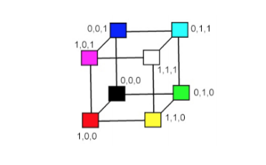
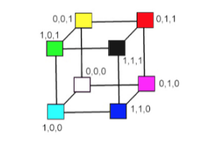
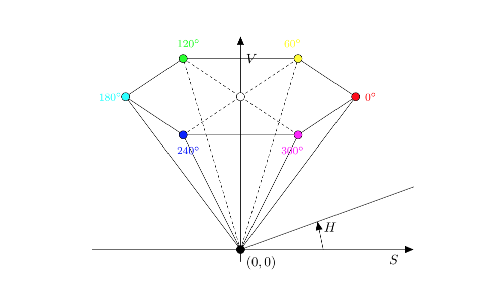

# Elementy Grafiki Komputerowej

1. [Modele barw.](#modele-barw)
2. [Metody kompresji obrazów.](#metody-kompresji-obrazów)
3. [Formaty plików graficznych.](#formaty-plików-graficznych)
4. [Rzutowanie.](#rzutowanie)
5. [Rendering.](#rendering)
6. [Rasteryzacja, algorytmy rysowania prymitywów graficznych, antyaliasing.](#rasteryzacja) 
7. [Generowanie sceny przy pomocy “śledzenia promieni”.](#generowanie-sceny) 
8. [Algorytmy eliminowania powierzchni zasłoniętych.](#algorytm-eliminowania-powierzchni-zasłoniętych)
9. [Modele oświetlenia.](#modele-oświetlenia) 
10. [Materiały, tekstury.](#materiały-i-tekstury)

## Modele Barw

- Model barw jest to określony trójwymiarowy system współrzędnych
barw wraz z widzialnym podzbiorem, w którym leżą wszystkie barwy
z określonej gamy barw.
- Model barw ma umożliwiać wygodny wybór barw wewnątrz jakiejś
gamy barw.

### RGB
- Stanowi najpopularniejszą reprezentację barw.
- Oparty na trójchromatycznej teorii percepcji barw.
- Barwy podstawowe R, G, B są __mieszane addytywnie__, tzn. indywidualne udziały każdej barwy podstawowej są sumowane (mieszane) w celu uzyskania wyniku.

##### Reprezentacja Graficzna

- Bryła modelu RGB jest sześcianem o boku 1. W wierzchołkach tego sześcianu znajdują się barwy podstawowe: 
  - czerwona (1, 0, 0), 
  - zielona (0, 1, 0), 
  - niebieska (0, 0, 1), 
- barwy dopełniające: 
  - żółta (1, 1, 0), 
  - cyjan (0, 1, 1), 
  - magenta (1, 0, 1),
  - biała (1, 1, 1),
  - czarna (0, 0, 0). 
  
- Główna przekątna sześcianu (łącząca wierzchołek barwy czarnej i białej), z równym udziałem barwy podstawowej, reprezentuje poziomy szarości.

##### Wady i Zalety

Zalety:
- wygoda i szybkość obliczeń barw,
- odpowiada sposobom generowania barw na takich urządzeniach jak monitor i telewizor.

Wady:
- percepcyjna niejednorodność, tzn. słabe korelacje pomiędzy postrzeganą różnicą dwóch barw a ich euklidesową odległością w sześcianie RGB,
- nieintuicyjność posługiwania się składowymi, R, G, B w określaniu barwy – problem z wizualizacją barwy na podstawie znajomości składowych RGB,
- wrażliwość wartości składowych na zmiany poziomu oświetlenia (iluminacji) sceny,
- jednoczesne operacje wykonywane na wszystkich składowych mogą prowadzić do przekłamania kolorów (np. rozjaśnienie obrazu RGB wymaga ingerencji we wszystkie składowe obrazu).

### CMY

- Barwy cyjan, magenta i żółta są barwami dopełniającymi odpowiednio dla barw: czerwonej, zielonej, niebieskiej.
- Podstawowe barwy subtraktywne to barwy filtrów używanych w celu odjęcia barwy od barwy światła białego.

##### Reprezentacja Graficzna

- Model CMY jest tak samo reprezentowany w układzie współrzędnych jak model RGB z tą różnicą, że barwa biała (pełne światło) znajduje się w początku układu współrzędnych (a nie barwa czarna - brak światła). Barwy są określane przez to co zostało usunięte albo odjęte od światła białego, a nie przez to co zostało dodane do czerni.

### CMYK

- Model CMYK używa dodatkowo czwartej barwy - barwy czarnej (K).
- Jest używany w czterobarwnych urządzeniach drukarskich wykorzystujących proces czterobarwny i w niektórych urządzeniach tworzących trwałe kopie.
- Dla danej specyfikacji CMY barwa czarna jest używana zamiast równych wartości C, M, Y.

### YUV / YIQ

- Modele te wykorzystuje się do kodowania barw w transmisji sygnału TV (analogowego), kodowania PAL, SECAM oraz NTSC.
- Modele YUV (Europa) oraz YIQ (USA, Kanada, Japonia) niezależnie opisują składowe luminacji oraz chrominancji barwy. Barwa jest reprezentowana w formacie: chrominancja-luminacja.
- Reprezentują barwę w formacie: chrominancja-luminacja. Chrominancja - składowa analogowego lub cyfrowego sygnału obrazu kolorowego odpowiadająca za odcień oraz nasycenie koloru.
- Składowa Y oznacza luminancję. Jest zdefiniowana tak, żeby odpowiadała składowej podstawowej Y w modelu CIE. Składowa Y stanowi czarno-białą treść obrazu kolorowego.
- Składowe UV oraz IQ są tzw. sygnałami różnicowymi i niosą informacje o barwie (chrominancja).
- W modelach YUV i YIQ wykorzystuje się dwie użyteczne właściwości systemu wzrokowego:
  - system jest bardziej czuły na zmiany luminancji niż na zmiany odcienia barwy albo nasycenia, tzn. że człowiek ma mniejszą zdolność do przestrzennego dyskryminowania informacji barwnej niż zdolność do przestrzennego dyskryminowania informacji monochromatycznej. A zatem do reprezentacji wartości Y, aby uzyskać większą rozdzielczość dla Y, powinna być używana większa liczba bitów pasma niż do reprezentowania i oraz Q.
  - detale obrazu, wytwarzają ograniczone wrażenia barwne, dlatego wystarczy, aby je określać za pomocą jednego a nie dwóch parametrów barwy, czyli albo i albo Q mogą mieć mniejsze pasmo.

### HSV

- Model HSV (odcień barwy, nasycenie i wartość) został zaproponowany w 1978 roku przez Alveya Raya Smitha.
- Jest zorientowany na użytkownika i wykorzystuje intuicyjne wrażenia modelu artysty a więc tinty, tony i cienie.

##### Reprezentacja Graficzna

- Model HSV jest reprezentowany w cylindrycznym układzie współrzędnych jako ostrosłup sześciokątny, którego podstawa ma wartość V = 1.
- W podstawie ostrosłupa zawarte są wszystkie względnie jasne barwy, ale nie wszystkie barwy w płaszczyźnie podstawy ostrosłupa mają taką samą percepcyjnie jasność.

## Metody Kompresji Obrazów

- Zmniejszenie głębi barw (kodowanie koloru)
- Zmniejszenie rozdzielczości (podmiana kilku pikseli na jeden o uśrednionym kolorze)
- W sumie to nie ma tego zbyt wiele...

### Kompresja bezstratna

Lossless compression to ogólna nazwa takich metod upakowywania informacji do postaci zawierającej zmniejszoną liczbę bitów tak, aby całą informację dało się z tej postaci odtworzyć do identycznej postaci pierwotnej.

Popularne metody:
- BZIP2
- Kodowanie Huffmana
- Kodowanie arytmetyczne

Popularne formaty:
- GIF
- PNG

### Kompresja stratna

Kompresja stratna jest możliwa ze względu na sposób działania ludzkich zmysłów, tj. wyższą wartość pewnych części danych nad innymi. Algorytmy kompresji stratnej zazwyczaj posługują się modelami psychoakustycznymi, psychowizualnymi itd., aby odrzucić najmniej istotne dane o dźwięku, obrazie, pozostawiając dane o wyższej wartości dla rozpoznawania tej informacji (akustycznej, wizualnej) przez zmysły. 

Popularne formaty kompresji stratnej obrazu:
- JPEG
- JPEG2000 (kompresja falkowa)

## Formaty Plików Graficznych

#### Grafika Rastrowa 

- JPEG
- TIFF
- PNG
- BMP
- ...

#### Grafika Wektorowa

- PDF
- SVG
- SWF
- EPS
- ...

#### Pliki CAD

- DWG
- DGN
- STL
- ...

## Rzutowanie

- Rzutowanie polega na przekształceniu punktów w n wymiarowej przestrzeni na punkty w n − 1 wymiarowej przestrzeni.
- W grafice komputerowej wykorzystuje się rzutowanie z przestrzeni 3-wymiarowej do przestrzeni 2-wymiarowej.
- Planarne rzuty geometryczne (rzuty) można podzielić na dwie podstawowe klasy:
  - rzuty równoległe
  - rzuty perspektywiczne
  
### Rzutowanie Perspektywiczne

- W rzutowaniu perspektywicznym odległość między środkiem rzutowania a płaszczyzną rzutowania jest skończona.
- Rzuty perspektywiczne dzielimy ze względu na liczbę podstawowych punktów zbieżności, a tym samym ze względu na liczbę osi przecinanych przez rzutnię.

### Rzutowanie Równoległe

- W rzutowaniu równoległym odległość między środkiem rzutowania a płaszczyzną rzutowania zbiega do nieskończoności.
- Skoro środek rzutowania znajduje się w nieskończoności, więc promienie rzutujące są do siebie równoległe i mają ten sam kierunek k.

#### Podział Rzutów Równoległych

##### Rzuty ortogonalne

- Kierunek rzutowania jest prostopadły do rzutni
- Umożliwiają mierzenie odległości i kątów
- Najbardziej popularne: 
  - przedni, 
  - górny, 
  - boczny
- Aksonometryczne rzuty ortogonalne
  - Przypominają rzut perspektywiczny, różnica polega na tym, że skrót jest równomierny, a nie jest związany z odległością od środka rzutu.
  - Równoległość linii jest zachowana, ale równość kątów nie jest zachowana, a odległości mogą być mierzone wzdłuż każdej głównej osi.
  - Rzuty izometryczne
    - normalna do rzutni tworzy równe kąty z głównymi osiami,
    - wszystkie trzy podstawowe osie są jednakowo skrócone, dzięki temu można wykonywać pomiary wzdłuż osi w tej samej skali,
    - kąty między rzutami głównych osi są takie same i wynoszą 120 stopni

##### Rzuty ukośne

- Normalna do rzutni i kierunek rzutowania różnią się
- Łączą właściwości rzutów prostokątnych czołowego, górnego i bocznego z właściwościami rzutu aksonometrycznego:
  - rzutnia jest prostopadła do głównej osi,
  - jeśli rzutujemy obiekt znajdujący się na płaszczyźnie równoległej do rzutni, to można wykonywać pomiary kątów i odległości,
  - jeśli rzutujemy obiekt znajdujący się na płaszczyźnie, która nie jest równoległa do rzutni, to można wykonywać pomiary odległości wzdłuż głównych osi.
  
### Różnice

Perspektywiczny:
- sprawia wrażenie realistycznego,
- zmienia relacje odległości,
- brak szczególnych zastosowań do rejestrowania dokładnego kształtu i pomiarów obiektów.

Równoległy:
- daje obraz mniej realistyczny,
- zachowuje równoległość prostych,
- zachowuje stosunek długości odcinków równoległych,
- zachowuje związki miarowe figury płaskiej równoległej do płaszczyzny rzutowania,
- stosuje się go głównie w rysunku technicznym.

## Rendering

[Link](https://pl.wikipedia.org/wiki/Renderowanie)

Renderowanie w grafice trójwymiarowej, nazywane też w tym kontekście obrazowaniem lub prezentacją, obejmuje analizę modelu danej sceny oraz utworzenie na jej podstawie dwuwymiarowego obrazu wyjściowego w formie statycznej lub animacji. Podczas renderowania rozpatrywane są m.in. odbicia, cienie, załamania światła, wpływy atmosfery (w tym mgła), efekty wolumetryczne itp. Jest to bardzo czasochłonna operacja niewymagająca, poza przygotowaniem, żadnej ingerencji ze strony człowieka.

Najczęściej wykorzystywaną metodą renderowania w programach do grafiki trójwymiarowych jest śledzenie promieni, pozwalająca na bardzo wierne symulowanie obrazu z uwzględnieniem wielu rzeczywistych zjawisk fizycznych.

## Rasteryzacja

Rasteryzacja – działanie polegające na jak najwierniejszym przedstawieniu płaskiej figury geometrycznej na urządzeniu rastrowym, dysponującym skończoną rozdzielczością.

### Rysowanie odcinka

- Dane są punkty końcowe odcinka (x0, y0),(xk, yk).
- __Założenia__: |a| <= 1 oraz x0 <= xk, y0 <= yk.
- Zaczynając od punktu (x0, y0) będziemy zwiększać wartość x o 1, obliczając kolejne piksele odcinka.
- Aby obliczyć i-ty piksel odcinka, dla punktu xi obliczamy wartość yi = a · xi + b i obliczoną wartość zaokrąglamy (w górę lub w dół) do liczby całkowitej, czyli i-ty piksel odcinka, to punkt o współrzędnych (xi, round(yi)).

Algorytm Bresenhama

Algorytm z punktem środkowym

Algorytm z podwójnym krokiem

### Rysowanie okręgu

- Rysowanie okręgu
- Okrąg o środku w początku układu współrzędnych i promieniu równym R ma postać: x^2 + y^2 = R^2
- Okrąg, którego środek nie leży w początku układu współrzędnych może zostać przesunięty do początku układu współrzędnych.
- Możemy narysować tylko 1/4 łuku okręgu, czyli y = round(√R^2 − x^2), dla x ∈ [0, R] i stosując symetrię odbić 4 razy ten fragment łuku względem osi.

### Antyaliasing

Zespół technik służących zmniejszeniu liczby błędów zniekształceniowych aliasing lub schodkowania obrazu, powstających przy reprezentacji obrazu lub sygnału o wysokiej rozdzielczości w rozdzielczości mniejszej.

## Generowanie sceny

Technika generowania fotorealistycznych obrazów scen trójwymiarowych. Opiera się na analizowaniu tylko tych promieni światła, które trafiają bezpośrednio do obserwatora.

### Algorytm

Algorytm śledzenia promieni wygląda następująco:
- Z punktu w którym znajduje się obserwator wyprowadzany jest promień pierwotny, który przecina rzutnię.
- Wyszukiwany jest najbliższy punkt przecięcia z obiektami znajdującymi się na scenie.
- Następnie dla każdego źródła światła zdefiniowanego na scenie wyznaczana jest jasność w tym punkcie, zgodnie z określonym modelem oświetlenia (np. Lamberta czy Phonga).

## Algorytm eliminowania powierzchni zasłoniętych

- Algorytmy przestrzeni danych – wyznaczają reprezentację obszaru widocznego, na podstawie której moża wykonać wiele obrazów, o dowolnej rozdzielczości (w tym obrazy otrzymane po zmianie rzutni, przy ustalonym położeniu obserwatora),
  - algorytm odrzucania ścian tylnych,
  - algorytm analizy położenia obiektów w przestrzeni i informacji z rzutu,
  - algorytm Ricciego,
  - algorytm Appela.
- Algorytmy przestrzeni obrazu – wynikiem takiego algorytmu jest obraz, czyli tablica odpowiednio pokolorowanych pikseli. Dla każdego piksela mogą być dodatkowe informacje z nim związane. Zmiana rozdzielczości obrazu wymaga ponownego wykonania algorytmu widoczności.
  - algorytm z buforem głębokości,
  - algorytm malarski (sortowania ścian),
  - algorytm przeglądania liniami poziomymi,
  - algorytm podziału binarnego,
  - algorytm rysowania powierzchni krzywoliniowych.

### Algorytm Malarski

Posortuj elementarne fragmenty sceny (wielokąty) od najdalszej od ob-
serwatora, czyli leżącej najgłębiej w kierunku patrzenia do najbliższej.

• Pomaluj fragmenty obrazu w tej kolejności.

• Sortowanie położenia ścian względem położenia obserwatora jest zada-
niem trudnym i może prowadzić do niejednoznaczności.

• Dla każdej ściany definiuje się ograniczenia:
– x-ograniczenie jako przedział [xmin, xmax] taki, że współrzędne x

wszystkich punktów tego obiektu należą do tego przedziału, ana-
logicznie definiujemy y-ograniczenia, z-ograniczenia,

– xy - ograniczenie jako prostokąt [xmin, xmax] × [ymin, ymax], analo-
gicznie definiujemy xz i yz ograniczenia,

– xyz - ograniczenie jako prostopadłościan [xmin, xmax]×[ymin, ymax]×
[zmin, zmax].

## Modele oświetlenia

[Całkiem przyjemny opis modeli oświetlenia](http://mst.mimuw.edu.pl/lecture.php?lecture=gk1&part=Ch10)

- __Oświetlenie bezkierunkowe__ - Najprostszy model oświetlenia opiera się na założeniu, że przestrzeń, w której znajdują się rysowane obiekty, jest wypełniona światłem, które dochodzi ze wszystkich kierunków z taką samą intensywnością. Założenie to jest nieodległe od prawdy, jeśli scena jest umieszczona w pomieszczeniu o jasnych (np. białych) matowych ścianach i obiekty te są oświetlone przede wszystkim światłem odbitym od ścian.

- __Odbicie lambertowskie__ - opisuje tzw. lambertowski model odbicia światła. Oprócz światła rozproszonego w otoczeniu, o określonej intensywności mamy też pewną liczbę punktowych źródeł światła. Intensywność oświetlenia powierzchni przez źródło jest opisana przez funkcję zależną od długości fali świetlnej, a także od odległości źródła światła od oświetlanego punktu, jeśli ta odległość jest skończona. __Lambertowski model oświetlenia opiera się na założeniu, że obiekty są idealnie matowe,__ a zatem światło odbite od powierzchni rozchodzi się we wszystkich kierunkach nad powierzchnią z taką samą intensywnością. Nie ma w tym modelu możliwości otrzymania na obrazie odblasków, które można zaobserwować na powierzchniach błyszczących.

- __Model Phonga__ - Odblaski są możliwe do uzyskania w modelu opracowanym w 1975r. przez Phong Buoi-Tuonga. Należy podkreślić, że model Phonga jest czysto empiryczny, tj. nie ma on podstaw fizycznych, ale dobierając odpowiednio jego parametry, można osiągnąć dosyć dobre przybliżenie wyglądu różnych materiałów na obrazie. Najczęściej obiekty narysowane za pomocą tego modelu mają wygląd nieco ,,plastikowy”. Jest to spowodowane przez dość dobre przybliżenie skutków odbicia światła od przedmiotów wykonanych z plastiku.

## Materiały i tekstury

### Materiały

Materiał – zespół cech powierzchni obiektu trójwymiarowego przetwarzanego w programie graficznym lub bibliotece programistycznej; oprogramowanie użytkowe pozwala zwykle tworzyć zestawy materiałów, które następnie można wielokrotnie używać.

Materiał opisuje:
- model oświetlenia (np. Phonga, Blinna) oraz jego parametry,
- barwę powierzchni, barwę światła odbitego i rozproszonego,
- tekstury i ich modyfikacje.
- stopień przezroczystości,
- współczynnik załamania światła,

### Tekstury

Teksturowanie – technika stosowana w grafice trójwymiarowej, której celem jest przedstawienie szczegółów powierzchni obiektów przestrzennych za pomocą obrazów bitmapowych (tekstur) lub funkcji matematycznych (tekstur proceduralnych). 

Mapowanie tekstury określa, w jaki sposób powiązać piksele (nazywane w tym kontekście tekselami) lub wartości funkcji z powierzchnią obiektu. 

Tekstury niosą informacje o barwie powierzchni, jak również innych parametrach generowanego obrazu, związanych np. z modelem oświetlenia: barwa światła odbitego, rozproszonego, stopień przezroczystości, współczynnik załamania światła itp.
